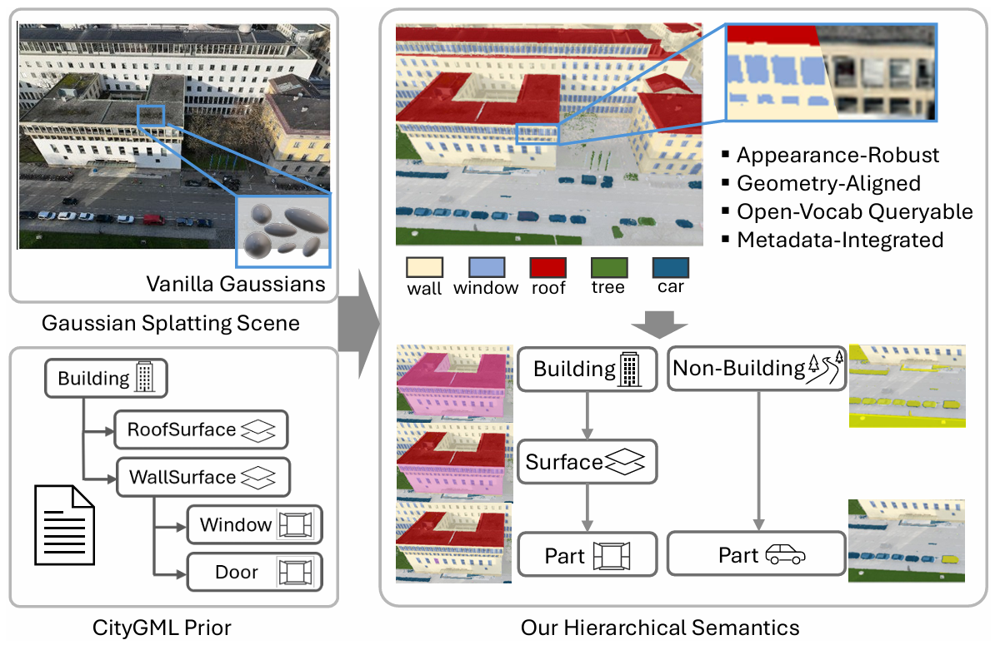
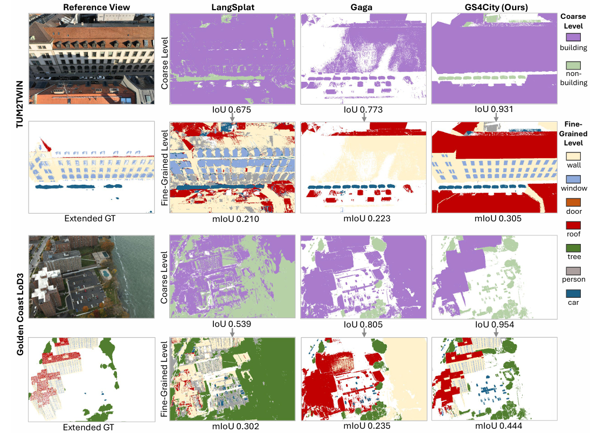
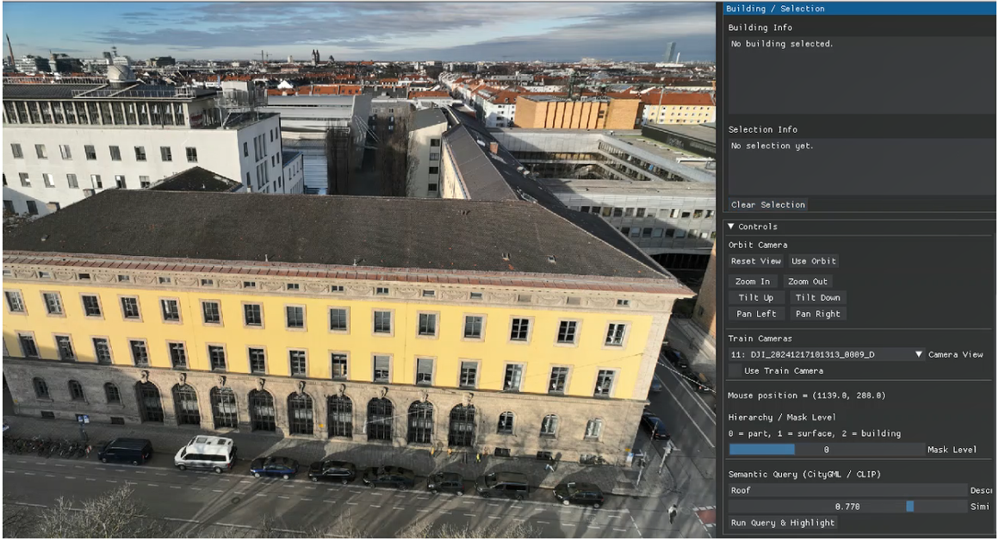
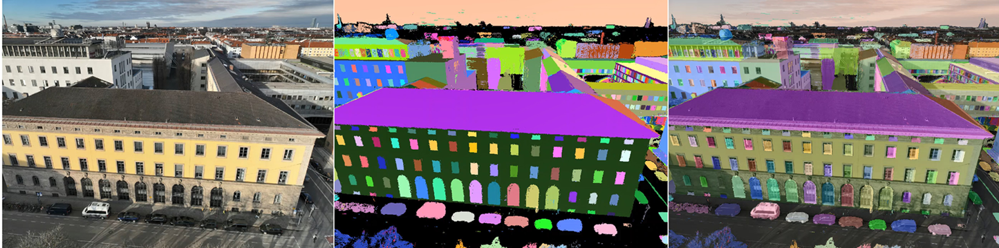
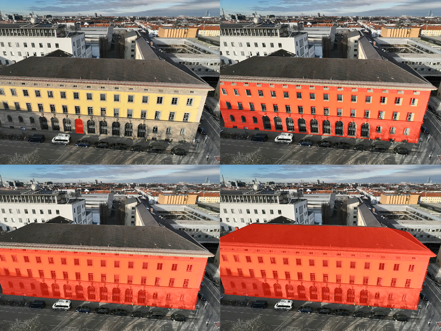
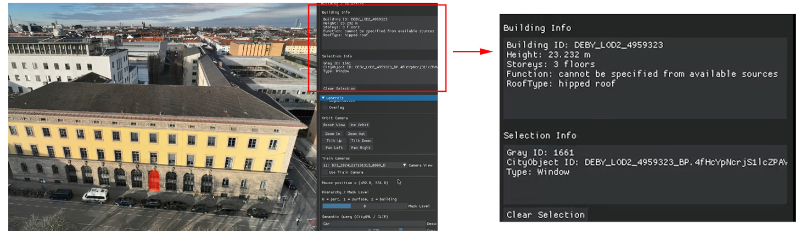
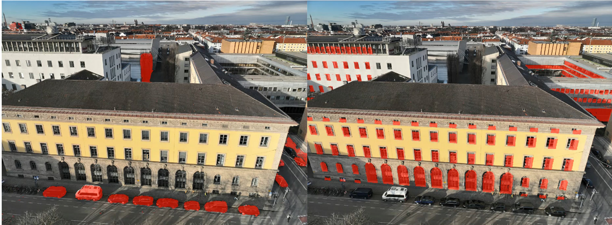

# GS4City

## Introduction

**GS4City** is a hierarchical semantic Gaussian Splatting method that incorporates city model priors for urban scene understanding.



This project builds upon the following prior works:

* [Gaga](https://github.com/weijielyu/Gaga)
* [Gaussian Grouping](https://github.com/lkeab/gaussian-grouping)
* [Gaussian Splatting](https://github.com/graphdeco-inria/gaussian-splatting)

The experiments in this project are conducted on the [TUM2TWIN dataset](https://github.com/tum-gis/tum2twin).




## Preprocessing

Before running the pipeline, complete the following three preprocessing steps.

### Structure-from-Motion (SfM)

Use an SfM tool to reconstruct a sparse scene from multi-view images. The following files must be generated:

```bash
sparse/0/cameras.bin
sparse/0/frames.bin
sparse/0/images.bin
sparse/0/points3D.bin
```

### 3D Gaussian Splatting Pretraining

Train a 3DGS model using the original Gaussian Splatting implementation. Place the trained model under:

```bash
model/<pretrained_model_name>/
```

### CityGML Semantic Data Preparation

Prepare semantic data from CityGML using the preprocessing pipeline provided in [CityGML2Mask](https://github.com/Jinyzzz/CityGML2Mask)

Place the result files under:

* `gml_mask/` (per-view `.npy` masks)
* `gml_mask_vis/` (visualization images)
* `city_semantics.json`
* `id_mapping.json`


## Project Structure

The project directory should follow this structure:

```bash
your_project/
├─ dataset/
│  └─ <scene_name>/
│     ├─ images/
│     ├─ gml_mask/
│     ├─ gml_mask_vis/
│     ├─ sparse/
│     │  └─ 0/
│     │     ├─ cameras.bin
│     │     ├─ frames.bin
│     │     ├─ images.bin
│     │     └─ points3D.bin
│     ├─ city_semantics.json
│     └─ id_mapping.json
├─ model/
├─ weight/
├─ output/
```

### Requirements

* Files in `images/`, `gml_mask/`, and `gml_mask_vis/` must correspond one-to-one (same filename, different extensions).


## Mask Preparation

### 1.SAM Mask Generation

```bash
python get_sam_mask.py --scene <scene_name> --gml --clip --visualize
```

**Outputs:**

* `dataset/<scene_name>/raw_sam_mask/`
* `dataset/<scene_name>/raw_sam_mask_vis/`

**Key Parameters:**

* `--scene`: scene identifier
* `--gml`: enable filtering using CityGML masks
* `--clip`: enable CLIP-assisted classification
* `--visualize`: save visualization results

**Default Configuration:**

* `mask/config.json`


### 2.Cross-View Mask Association

```bash
python associate.py --scene <scene_name> --model <pretrained_model_name> --visualize --clip
```

**Outputs:**

* `dataset/<scene_name>/sam_mask/`
* `dataset/<scene_name>/sam_mask_vis/`

**Key Parameters:**

* `--scene`: scene identifier
* `--model`: pretrained 3DGS model name
* `--visualize`: enable visualization
* `--clip`: enable CLIP-based matching

**Default Configuration:**

* `mask/config.json`
* `arguments.py`


### 3.Mask Fusion and CLIP Feature Extraction

```bash
python fuse_masks.py --scene <scene_name>
```

**Outputs:**

* `dataset/<scene_name>/fused_mask/`
* `dataset/<scene_name>/fused_mask_vis/`
* `dataset/<scene_name>/object_clip_index.npz`

**Key Parameters:**

* `--scene`: scene identifier


## Semantic Training

### Training

```bash
python train.py \
  --scene <scene_name> \
  --model <pretrained_model_name> \
  --output <output_name> \
  --resolution 8 \
  --iterations 10000
```

**Outputs:**

* `output/<output_name>/`

  * `cfg_args`
  * `point_cloud/iteration_xxx/classifier.pth`
  * checkpoints (optional)

**Notes:**

* The training pipeline prioritizes `fused_mask/`; if unavailable, it falls back to `sam_mask/`.


### Rendering

```bash
python render.py --output_name <output_name> --render_video
```

**Outputs:**

* `output/<output_name>/train/ours_<iter>/`
* `output/<output_name>/test/ours_<iter>/`


## GUI Visualization

The GUI integrates **CityGML semantic knowledge** with **CLIP-based open-vocabulary features**, enabling interactive exploration and querying of the reconstructed 3D scene.



```bash
python main_gui.py \
  -s dataset/<scene_name> \
  --model_path output/<output_name> \
  --iteration 10000 \
  --gui_width 1024 \
  --gui_height 768
```

### Required Inputs

* `dataset/<scene_name>`
* `output/<output_name>`

### Required Files (copy into output directory)

* `city_semantics.json`
* `id_mapping.json`
* `object_clip_index.npz`


### View Mode Switching

Switch between different visualization modes: RGB mode, Segmentation mode and Overlay mode.



### Hierarchical Semantic Interaction

Interact with the scene using hierarchical semantics derived from CityGML:

* building → surface → part
* enables structured understanding of urban elements



### Semantic Attribute Retrieval

Click on any object in the scene to retrieve its corresponding **CityGML semantic information**.



### Semantic Search

Perform hybrid semantic queries combining:

* **structured labels** (e.g., building components from CityGML)
* **open-vocabulary queries** (via CLIP for non-building elements)




## Configuration Files

* `mask/config.json`: preprocessing parameters (SAM, CLIP, projection)
* `config/train.json`: training parameters
* `arguments.py`: shared configuration
